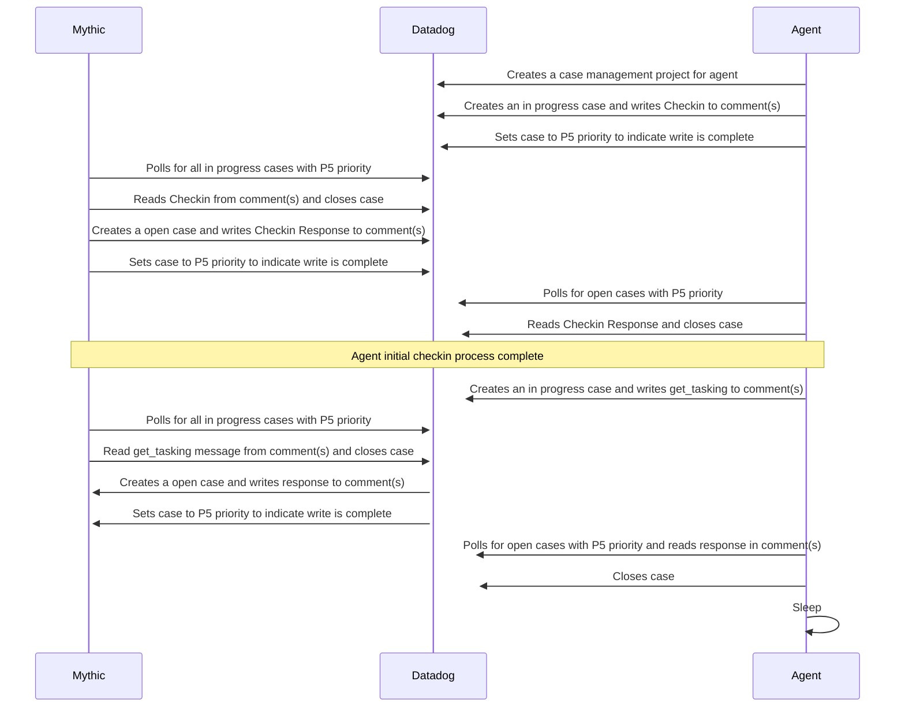

## Table of Contents
1. [Overview](#overview)
2. [Setup](#setup)
3. [Agent Build](#agent-build)
4. [OPSEC](#opsec)
5. [Development](#development)

## Overview
Uses the datadog case management API to perform C2 communications.  A two week datadog free trial can be obtained with any valid gmail email address by using the 'Sign Up With Google' link on the datadog (Sign Up Page)[https://app.datadoghq.com/signup]

### GitHub C2 Workflow


## Setup

### 1. Datadog
Sign up for a datadog tenant.

Create an API Key and an Application Key for Mythic.

### 5. Mythic Configuration
With the GitHub pieces in place, the Mythic GitHub C2 Profile is ready to be configured. 

Once installed:
* Log into the Mythic server web interface and select the headphone icon to browse to *C2 Profiles and Payload Types*
* To the right of the github c2 profile line, select the dropdown next to *Start Profile* and choose *View/Edit Config*
* From there, fill in all the details to match the settings from the previous setup steps.

Example Configuration
```
{
    "debug": true,
    "app_key": "",
    "api_key": "",
    "region": "us1"
}
```

After entering the configuration settings, Submit them and Start the C2 profile!

## Agent Build

### Profile Build Parameters

#### Callback interval in seconds
A number to indicate how many seconds the agent should wait in between tasking requests.

#### Callback Jitter
Percentage of jitter effect for callback interval.

#### Crypto Type
Indicate if you want to use no crypto (i.e. plaintext) or if you want to use Mythic's aes256_hmac. Using no crypto is really helpful for agent development so that it's easier to see messages and get started faster, but for actual operations you should leave the default to aes256_hmac.

#### Datadog API Key


#### Datadog App Key


#### Kill Date
Date for the agent to automatically exit, probably should line up with when the trial ends.

#### Perform Key Exchange
T or F for if you want to perform a key exchange with the Mythic Server. When this is true, the agent uses the key specified by the base64 32Byte key to send an initial message to the Mythic server with a newly generated RSA public key. If this is set to `F`, then the agent tries to just use the base64 of the key as a static AES key for encryption. If that key is also blanked out, then the requests will all be in plaintext.

#### Proxy Password
If you need to authenticate to the proxy endpoint, specify the password here.

#### Proxy Host
If you need to manually specify a proxy endpoint, do that here. This follows the same format as the callback host.

#### Proxy Port
If you need to manually specify a proxy endpoint, this is where you specify the associated port number.

#### Proxy Username
If you need to authenticate to the proxy endpoint, specify the username here.

#### User Agent
The User Agent to be passed in the HTTP requests for calls to the REST API


## OPSEC
A few considerations:
* Scope the Application Keys to prevent abuse if the agent is compromised.

